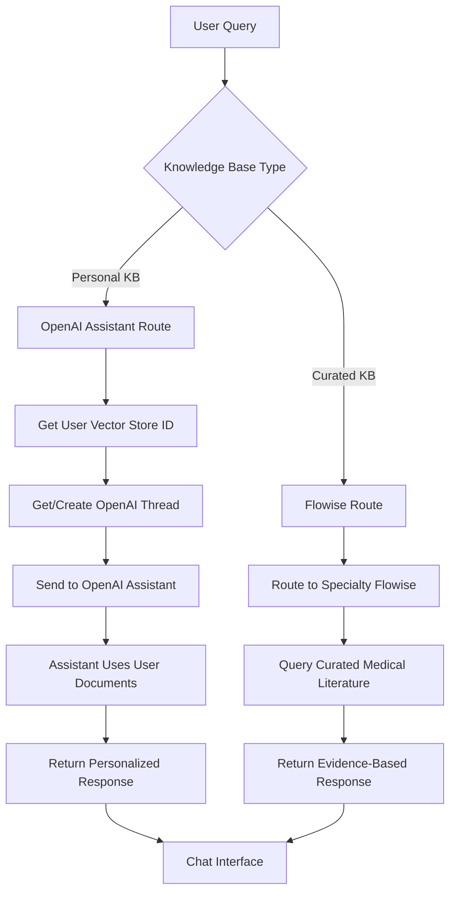

# Dual-Routing Knowledge Base Architecture

## Overview

The MediMind Expert platform now implements a **dual-routing architecture** that intelligently routes queries to different AI backends based on the selected knowledge base type:

- **Personal Knowledge Base** → OpenAI Assistants (with user Vector Stores)
- **Curated Knowledge Base** → Flowise Chatbots (medical literature)

## Architecture Flow



## Implementation Details

### 1. API Routing (src/lib/api/chat.ts)

The chat API now routes requests based on `knowledgeBaseType`:

```typescript
// ROUTE BASED ON KNOWLEDGE BASE TYPE
const isPersonalKB = knowledgeBaseType === 'personal';

if (isPersonalKB) {
  // Route to OpenAI Assistants for personal knowledge base
  apiEndpoint = '/api/openai-assistant';
} else {
  // Route to Flowise for curated knowledge base
  apiEndpoint = '/api/flowise/chat';
}
```

### 2. OpenAI Assistants Integration

#### New Function: `functions/openai-assistant.js`

- **Cardiology Assistant**: `asst_ov0Jukmipraw1CHFXir58p9r`
- **OB/GYN Assistant**: `asst_9WyiKUGg7eJis2wDuFQwsCjz`

#### Key Features:
- Automatic Vector Store integration with user documents
- Thread management for conversation continuity
- Case context support
- Source citation extraction
- Specialty-specific assistant routing

### 3. Database Schema Updates

#### New Table: `openai_threads`

```sql
CREATE TABLE public.openai_threads (
    id UUID PRIMARY KEY DEFAULT gen_random_uuid(),
    user_id UUID REFERENCES auth.users(id) ON DELETE CASCADE NOT NULL,
    conversation_id TEXT NOT NULL,
    thread_id TEXT UNIQUE NOT NULL, -- OpenAI thread ID
    created_at TIMESTAMP WITH TIME ZONE DEFAULT NOW(),
    updated_at TIMESTAMP WITH TIME ZONE DEFAULT NOW()
);
```

### 4. Assistant Configuration

Assistants are configured to use user-specific Vector Stores:

```javascript
const runParams = {
  assistant_id: assistantId,
  tools: [{ type: 'file_search' }],
  tool_resources: {
    file_search: {
      vector_store_ids: [vectorStoreId]
    }
  }
};
```

## Flow Examples

### Personal Knowledge Base Query

1. User selects "Personal KB" and asks: "What does my uploaded research say about treatment protocols?"
2. System routes to `/api/openai-assistant`
3. Function fetches user's `openai_vector_store_id` from database
4. Creates/retrieves OpenAI thread for conversation
5. Sends query to specialty-specific assistant (cardiology/ob-gyn)
6. Assistant searches user's uploaded documents
7. Returns personalized response with document citations

### Curated Knowledge Base Query

1. User selects "Curated KB" and asks: "What are the latest AHA guidelines for hypertension?"
2. System routes to `/api/flowise/chat` (existing behavior)
3. Function routes to specialty-specific Flowise endpoint
4. Flowise queries curated medical literature
5. Returns evidence-based response with medical sources

## Environment Variables

Required environment variables:

```bash
# OpenAI Configuration
OPENAI_API_KEY=your_openai_api_key

# Flowise Endpoints (existing)
FLOWISE_CARDIOLOGY_URL=https://flowise-2-0.onrender.com/api/v1/prediction/f8433523-af63-4c53-8db9-63ed3b923f2e
FLOWISE_OBGYN_URL=https://flowise-2-0.onrender.com/api/v1/prediction/57a1285c-971d-48d4-9519-feb7494afe8b

# Supabase Configuration
SUPABASE_URL=your_supabase_url
SUPABASE_SERVICE_ROLE_KEY=your_service_key
```

## User Experience

### Knowledge Base Selection

Users can toggle between knowledge bases using the existing UI:
- **Personal KB**: Queries user's uploaded documents
- **Curated KB**: Queries medical literature database

### Seamless Integration

- **Same authentication** (Supabase user session)
- **Same chat interface** 
- **Same case management** features
- **Automatic specialty routing** (cardiology/ob-gyn)

## Benefits

### For Personal Knowledge Base:
- **Direct OpenAI Assistant access** with user documents
- **Advanced file search** capabilities
- **Conversation continuity** with thread management
- **Personalized responses** based on user's research

### For Curated Knowledge Base:
- **Proven Flowise integration** (existing system)
- **Curated medical literature** access
- **Evidence-based responses**
- **Specialty-specific knowledge**

## Error Handling

### Personal KB Errors:
- **No Vector Store**: "No personal knowledge base found. Please upload documents first."
- **Assistant timeout**: "Assistant response timeout" (60s limit)
- **Thread creation failure**: Automatic fallback with logging

### Fallback Strategy:
- Personal KB errors don't affect Curated KB functionality
- Each route is independent and resilient

## Development Notes

### Files Modified/Created:
- ✅ `functions/openai-assistant.js` (NEW)
- ✅ `src/lib/api/chat.ts` (MODIFIED - dual routing)
- ✅ `supabase_setup_safe.sql` (UPDATED - threads table)
- ✅ `netlify.toml` (UPDATED - API redirect)
- ✅ `migrations/openai_threads_table.sql` (NEW)

### Testing:
- ✅ Build verification completed
- ✅ TypeScript compilation successful
- ✅ OpenAI package integration verified

## Next Steps

1. **Database Migration**: Run `supabase_setup_safe.sql` to create threads table
2. **Environment Setup**: Ensure all environment variables are configured
3. **Assistant Configuration**: Verify OpenAI Assistants are properly configured in OpenAI dashboard
4. **User Testing**: Test knowledge base switching functionality
5. **Document Upload**: Ensure users have Vector Stores with documents for personal KB testing

## Monitoring

### Logs to Monitor:
- OpenAI Assistant request/response times
- Vector Store query performance
- Thread creation/retrieval success rates
- Routing decision accuracy

### Key Metrics:
- Personal KB vs Curated KB usage distribution
- Assistant response quality and speed
- User document search effectiveness
- Error rates by knowledge base type 